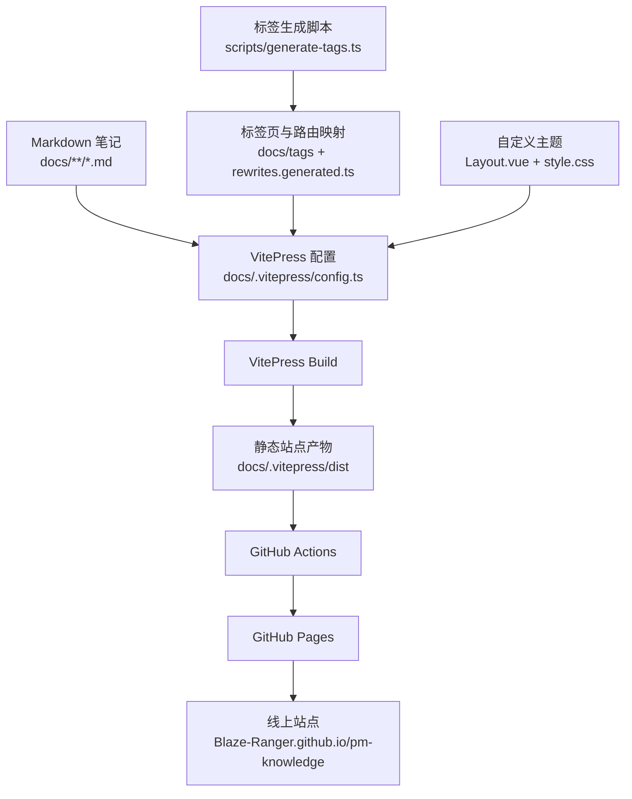

# PM Knowledge

## 网站地址

<https://Blaze-Ranger.github.io/pm-knowledge/>

## 技术构建

本站基于 [VitePress](https://vitepress.dev/) 构建,使用 GitHub Actions 自动部署到 GitHub Pages。

主要技术栈:

- VitePress
- Vue 3
- TypeScript
- pnpm
- GitHub Pages
- GitHub Actions

## 技术架构



构建流程:

1. Markdown 内容放在 `docs/` 目录。
2. `scripts/generate-tags.ts` 根据笔记 frontmatter 生成标签页与路由映射。
3. VitePress 读取 `docs/.vitepress/config.ts` 和自定义主题生成静态站点。
4. GitHub Actions 执行构建并将 `docs/.vitepress/dist` 部署到 GitHub Pages。

## 本地部署运行

环境要求:

- Node.js >= 20
- pnpm 9.12.0

安装依赖:

```bash
pnpm install
```

启动本地开发服务:

```bash
pnpm docs:dev
```

开发服务默认运行在:

<http://localhost:5173/>

生产构建:

```bash
pnpm docs:build
```

预览生产构建:

```bash
pnpm docs:preview
```

如果需要按本地根路径预览生产包:

```bash
pnpm docs:build:local
pnpm docs:preview:local
```

## 部署

推送到 `main` 分支后,GitHub Actions 会自动构建并部署到 GitHub Pages。

```bash
git add .
git commit -m "docs: update content"
git push origin main
```

构建产物目录:

```bash
docs/.vitepress/dist
```

## License

[MIT](./LICENSE)
